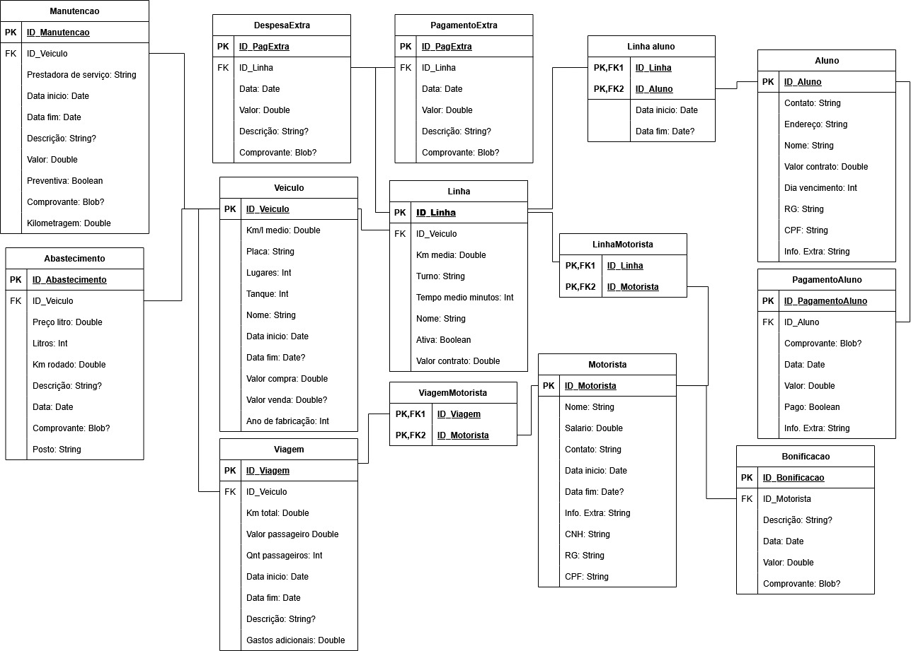

# Sistema de Gestão de Transporte Universitário

Este software é uma solução robusta para a administração de empresas de transporte universitário. Desenvolvido em Python, o sistema integra o controle operacional e financeiro em uma interface única, otimizada para a resolução HD (1280x720) e totalmente compatível com o ambiente Windows 7.

---

## Principais Funcionalidades

### Gestão Operacional
* **Motoristas**: Registro completo de condutores e controle de documentação.
* **Frota**: Cadastro de veículos, monitoramento de abastecimentos e histórico de manutenções.
* **Logística**: Planejamento de rotas e registro de viagens diárias.

### Gestão de Alunos e Financeiro
* **Passageiros**: Cadastro detalhado de alunos vinculados a rotas específicas.
* **Financeiro**: Controle de pagamentos, mensalidades e histórico de inadimplência.

### Inteligência de Negócio
* **Relatórios**: Geração de fechamentos detalhados por data selecionada.
* **Análise Visual**: Integração com gráficos para acompanhamento de métricas de desempenho e custos.

---

## Tecnologias Utilizadas

| Componente | Tecnologia                         |
| :--- |:-----------------------------------|
| Linguagem | Python 3.6                         |
| Interface Gráfica | Tkinter (Otimizada para Windows 7) |
| Armazenamento | SQLite3                            |
| Gráficos | Matplotlib                         |

---

## Requisitos de Sistema

Para garantir a melhor experiência e funcionamento do software:

* **Resolução de Tela**: Mínimo de 1280x720 (HD).
* **Sistema Operacional**: Windows 7 SP1 ou superior.
* **Ambiente**: Python 3.6 instalado.

---

## Instalação e Configuração

1. Clone este repositório para sua máquina local:
   git clone https://github.com/ThiaagoMP/gs-transportes.git

2. Instale as dependências necessárias via pip:
   pip install matplotlib, reportlab

3. Execute a aplicação:
   python main.py

---

## Estrutura do Banco de Dados

O sistema utiliza o SQLite3 por sua confiabilidade e ausência de necessidade de servidores externos. As tabelas principais são:

## Notas de Design

A interface foi construída utilizando os widgets nativos do Windows para assegurar que a renderização seja fluida em hardware legado e sistemas Windows 7. O esquema de cores e o dimensionamento dos botões foram pensados para clareza visual em monitores HD.